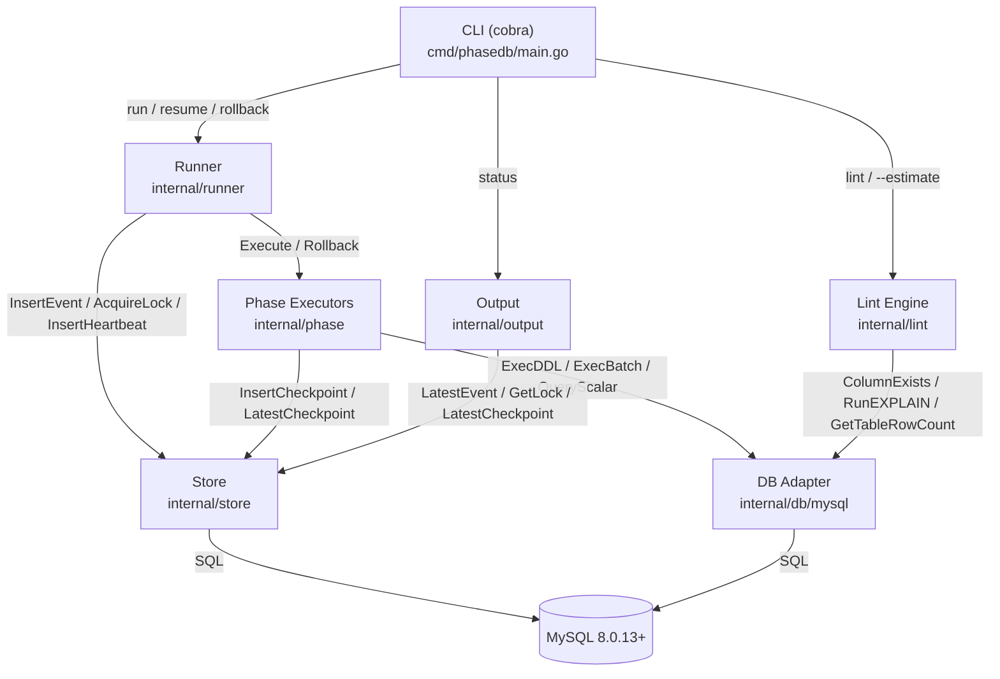
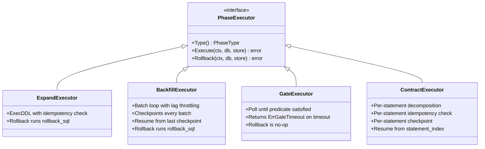

# Architecture

## Overview

phasedb is a single static binary. No daemon, no server, no sidecar. It connects directly to MySQL, acquires a distributed lock, and orchestrates the migration phases.



## Component Responsibilities

| Component | Package | Responsibility |
|---|---|---|
| **CLI** | `internal/cli` | Parse flags, wire deps, set up signal context, call runner |
| **Runner** | `internal/runner` | Phase loop, distributed lock, heartbeat, terminal event INSERT |
| **Phase Executors** | `internal/phase` | Phase logic only — return nil/error, never insert terminal events |
| **Store** | `internal/store` | Append-only audit tables + distributed lock table |
| **DB Adapter** | `internal/db/mysql` | DDL execution, batch DML, schema inspection, replication lag |
| **Lint** | `internal/lint` | Static analysis + dry-run estimates before execution |
| **Output** | `internal/output` | Status resolution, progress bar, structured logging |

## Dependency Flow

```
cli → runner → phase/executor
             → store
             → db/adapter

lint → db/adapter (read-only)
output → store (read-only)
```

No circular dependencies. All dependencies injected via constructors — no globals.

## Phase Executor Interface



**Key invariant**: executors return `nil` or an `error`. They **never** insert `PHASE_COMPLETED`, `PHASE_FAILED`, or `PHASE_TIMED_OUT` — the runner owns all terminal event inserts.

## Project Structure

```
phasedb/
├── cmd/phasedb/main.go          # cobra root, signal.NotifyContext, version via ldflags
├── internal/
│   ├── cli/                     # run, resume, status, rollback, lint, gc subcommands
│   ├── config/                  # YAML structs, validation, CLI overrides
│   ├── db/
│   │   ├── adapter.go           # Adapter interface
│   │   ├── factory.go           # NewAdapter — enforces loc=UTC
│   │   └── mysql/               # ExecDDL, ExecBatch, schema inspection, replication lag
│   ├── store/                   # Store interface, MySQL impl, schema migration
│   ├── runner/                  # Run loop, heartbeat, state transitions
│   ├── phase/                   # expand, backfill, gate, contract executors
│   ├── lint/                    # rules engine, vitess AST parser, estimates
│   └── output/                  # StatusJSON, progress bar, slog logger
├── migrations/                  # example YAML files
├── tests/integration/           # real-MySQL integration + E2E tests
├── Dockerfile
├── docker-compose.yml
└── .goreleaser.yml
```
