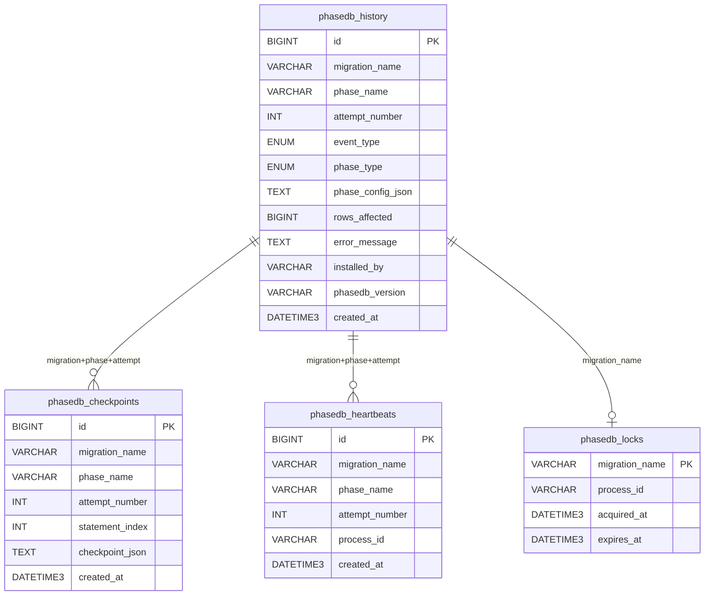

# Database Schema

phasedb manages four tables in your MySQL database. Three are append-only (immutable audit trail). One is mutable (distributed lock).



---

## phasedb_history

Immutable phase state transitions. Never updated or deleted.

```sql
CREATE TABLE IF NOT EXISTS phasedb_history (
    id                BIGINT UNSIGNED AUTO_INCREMENT PRIMARY KEY,
    migration_name    VARCHAR(256) NOT NULL,
    phase_name        VARCHAR(64)  NOT NULL,
    attempt_number    INT UNSIGNED NOT NULL,
    event_type        ENUM('PHASE_STARTED','PHASE_COMPLETED','PHASE_FAILED',
                           'PHASE_TIMED_OUT','PHASE_SKIPPED','PHASE_ROLLED_BACK') NOT NULL,
    phase_type        ENUM('EXPAND','BACKFILL','GATE','CONTRACT') NOT NULL,
    phase_config_json TEXT NOT NULL,
    rows_affected     BIGINT NULL,
    error_message     TEXT NULL,
    installed_by      VARCHAR(256) NOT NULL,
    phasedb_version   VARCHAR(32)  NOT NULL,
    created_at        DATETIME(3)  NOT NULL DEFAULT CURRENT_TIMESTAMP(3),
    UNIQUE KEY uq_attempt_event (migration_name, phase_name, attempt_number, event_type),
    KEY idx_latest (migration_name, phase_name, id DESC)
) ENGINE=InnoDB DEFAULT CHARSET=utf8mb4;
```

> `KEY idx_latest (..., id DESC)` requires MySQL **8.0.13+** — this is why the minimum version is 8.0.13, not 8.0.0.

**Current state** = most recent row for `(migration_name, phase_name)` ordered by `id DESC`.

---

## phasedb_checkpoints

Backfill and contract cursors. Immutable — new row per checkpoint. Never updated or deleted.

```sql
CREATE TABLE IF NOT EXISTS phasedb_checkpoints (
    id               BIGINT UNSIGNED AUTO_INCREMENT PRIMARY KEY,
    migration_name   VARCHAR(256) NOT NULL,
    phase_name       VARCHAR(64)  NOT NULL,
    attempt_number   INT UNSIGNED NOT NULL,
    statement_index  INT UNSIGNED NOT NULL DEFAULT 0,
    checkpoint_json  TEXT NOT NULL,
    created_at       DATETIME(3)  NOT NULL DEFAULT CURRENT_TIMESTAMP(3),
    KEY idx_resume (migration_name, phase_name, attempt_number, id DESC)
) ENGINE=InnoDB DEFAULT CHARSET=utf8mb4;
```

**Resume**: query most recent checkpoint for `(migration, phase, attempt_number)`. For CONTRACT, also use `statement_index` to skip already-applied statements.

---

## phasedb_heartbeats

Process liveness records. The only prunable table — `phasedb gc` deletes rows for completed migrations.

```sql
CREATE TABLE IF NOT EXISTS phasedb_heartbeats (
    id               BIGINT UNSIGNED AUTO_INCREMENT PRIMARY KEY,
    migration_name   VARCHAR(256) NOT NULL,
    phase_name       VARCHAR(64)  NOT NULL,
    attempt_number   INT UNSIGNED NOT NULL,
    process_id       VARCHAR(512) NOT NULL,
    created_at       DATETIME(3)  NOT NULL DEFAULT CURRENT_TIMESTAMP(3),
    KEY idx_liveness (migration_name, phase_name, attempt_number, created_at DESC)
) ENGINE=InnoDB DEFAULT CHARSET=utf8mb4;
```

**Dead process detection**: latest heartbeat row older than 90s = process dead.

**`phasedb gc`**: deletes all heartbeat rows for migrations where the latest `phasedb_history` event is terminal (`PHASE_COMPLETED`, `PHASE_FAILED`, `PHASE_TIMED_OUT`, or `PHASE_ROLLED_BACK`) across all phases.

---

## phasedb_locks

Distributed mutex. One row per migration. Mutable — updated by heartbeat, deleted on clean exit.

```sql
CREATE TABLE IF NOT EXISTS phasedb_locks (
    migration_name   VARCHAR(256) PRIMARY KEY,
    process_id       VARCHAR(512) NOT NULL,
    acquired_at      DATETIME(3)  NOT NULL,
    expires_at       DATETIME(3)  NOT NULL
) ENGINE=InnoDB DEFAULT CHARSET=utf8mb4;
```

---

## Privilege Matrix

| Table | SELECT | INSERT | UPDATE | DELETE |
|---|---|---|---|---|
| `phasedb_history` | ✓ | ✓ | ✗ | ✗ |
| `phasedb_checkpoints` | ✓ | ✓ | ✗ | ✗ |
| `phasedb_heartbeats` | ✓ | ✓ | ✗ | `phasedb gc` only |
| `phasedb_locks` | ✓ | ✓ | ✓ | ✓ (on release) |

```sql
GRANT SELECT, INSERT ON phasedb_history      TO 'phasedb'@'%';
GRANT SELECT, INSERT ON phasedb_checkpoints  TO 'phasedb'@'%';
GRANT SELECT, INSERT, DELETE ON phasedb_heartbeats TO 'phasedb'@'%';
GRANT SELECT, INSERT, UPDATE, DELETE ON phasedb_locks TO 'phasedb'@'%';
GRANT CREATE ON <your_db>.* TO 'phasedb'@'%';
```
