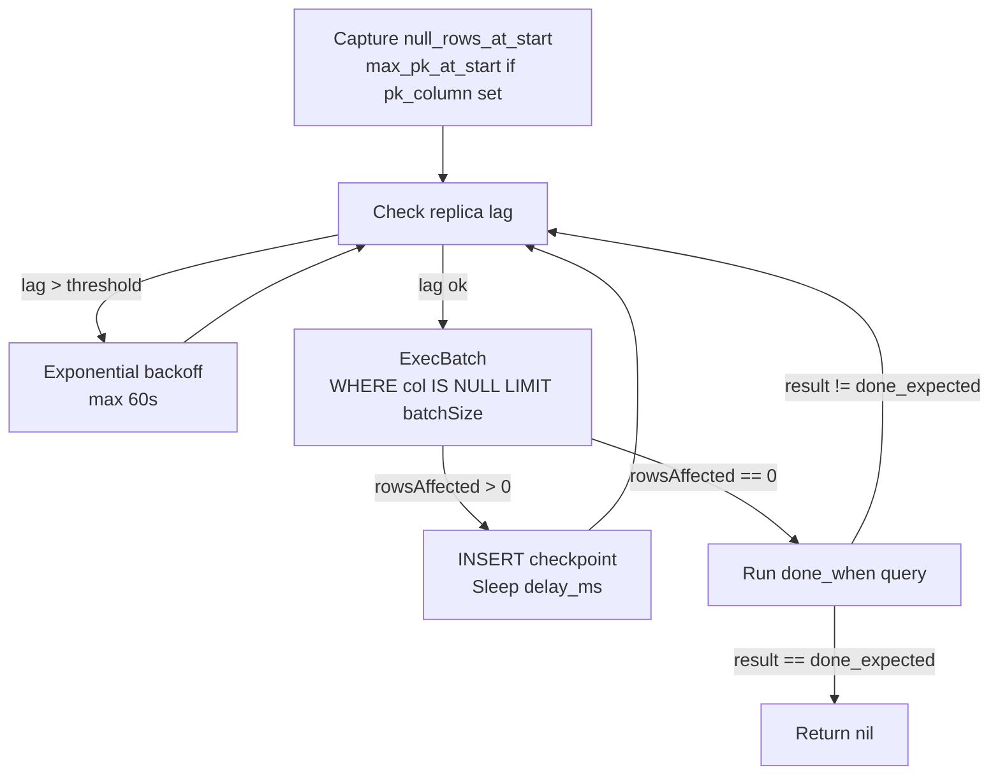
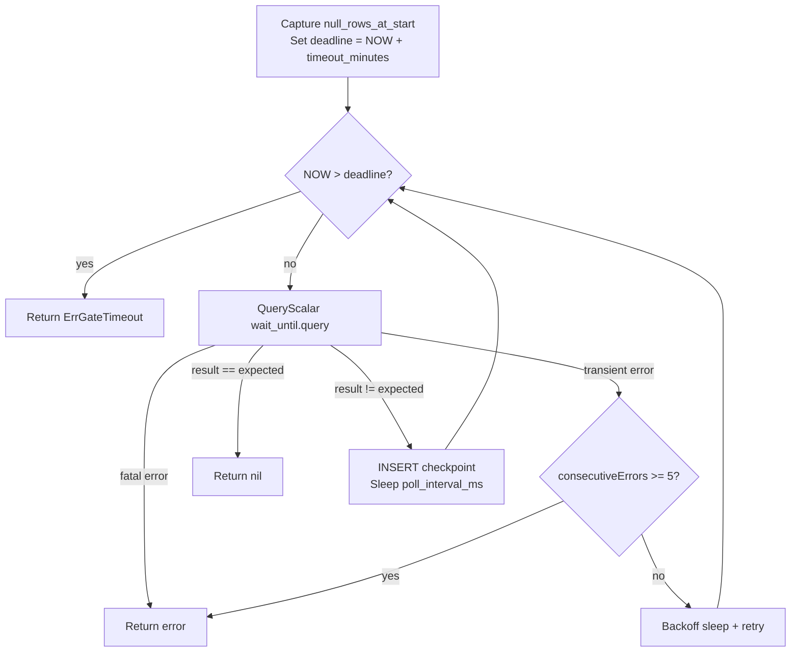
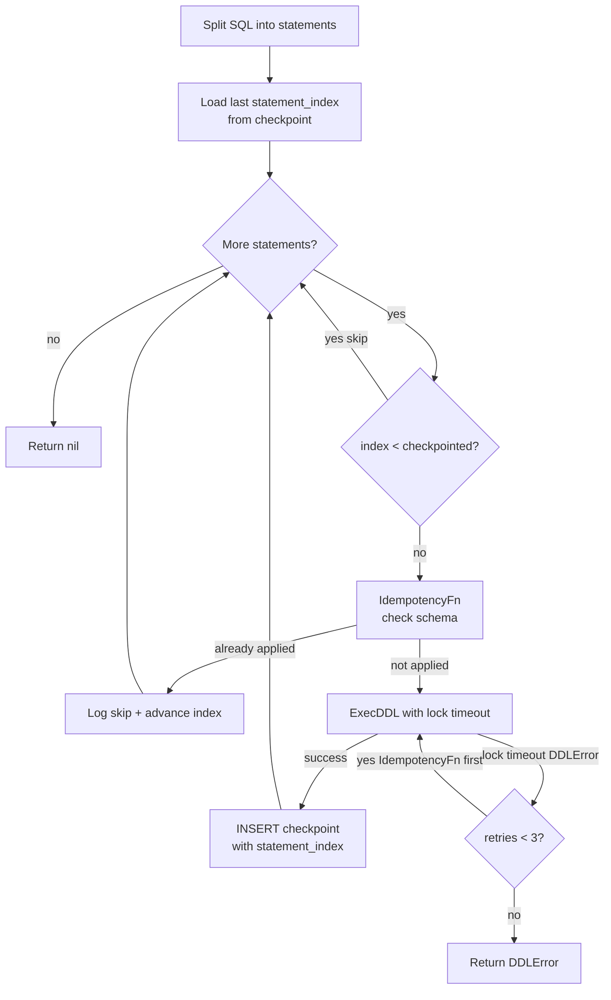

# Phase Reference

## Expand

Runs a DDL statement that broadens the schema without breaking existing reads or writes — typically adding a nullable column or a new table.

**Idempotency**: before executing, checks schema (`ColumnExists` / `IndexExists`). If already applied, skips DDL and logs `"already applied"`. Safe to re-run.

**Rollback**: runs `rollback_sql` if provided (e.g. `DROP COLUMN`).

```yaml
- name: expand
  sql: |
    ALTER TABLE events ADD COLUMN checksum VARCHAR(64) NULL;
  rollback_sql: |
    ALTER TABLE events DROP COLUMN checksum;
```

---

## Backfill

Fills data in small batches, throttled by replica lag. Designed to run for hours without locking the table or causing replication delay.

### Batch Loop



### Resume

Restarts the batch loop. `WHERE col IS NULL` naturally skips already-processed rows — idempotent by design. An unwritten batch (committed but not checkpointed) simply re-runs with `rowsAffected = 0`, which is handled correctly.

### Lag Throttling

- `GetReplicaLag()` checks `SHOW REPLICA STATUS`
- Returns `0` if privilege error (logs warning once, not per-batch)
- On lag > threshold: `sleep(min(delay_ms * 2^consecutiveLagEvents, 60s))`
- Resets after 3 consecutive good readings

### Progress

- **Every batch** (cheap): `progress = rows_processed_total / null_rows_at_start`
- **Every 5 min** (expensive): actual `SELECT COUNT(*) WHERE col IS NULL` updates denominator
- **ETA**: rolling 10-minute throughput window

### Checkpoint JSON

```json
{
  "rows_processed_total": 4200000,
  "batch_number": 4200,
  "null_rows_at_start": 8400000,
  "max_pk_at_start": 16800000,
  "last_batch_affected": 1000,
  "checkpointed_at": "2026-05-03T05:32:00Z"
}
```

`max_pk_at_start` is omitted when `pk_column` is not configured.

```yaml
- name: backfill
  on_failure: rollback
  batch:
    query: |
      UPDATE events
      SET checksum = SHA2(CONCAT(user_id, payload), 256)
      WHERE checksum IS NULL
      LIMIT {batch_size}
    size: 1000
    delay_ms: 10
    lag_threshold_ms: 500
    pk_column: id               # optional — integer PK upper bound
    done_when: "SELECT COUNT(*) FROM events WHERE checksum IS NULL"
    done_expected: 0
  rollback_sql: |
    UPDATE events SET checksum = NULL
```

---

## Gate

Polls a SQL condition until satisfied or timed out. Runs between backfill and contract to verify data integrity before schema is tightened.

### Poll Loop



### Error Classification

| Class | MySQL codes | Behaviour |
|---|---|---|
| **Fatal** | 1045, 1142, 1146, 1054, 1064, 1217, 1292, 1366, 1406 | Fail immediately |
| **Transient** | 1040, 1205, 2003, 2006 | Retry with exponential backoff, max 5 consecutive |

### Checkpoint JSON

```json
{
  "current_result": 4200,
  "progress_pct": 0.61,
  "null_rows_at_start": 10800,
  "estimated_completion": "2026-05-03T06:45:00Z",
  "checked_at": "2026-05-03T05:32:00Z"
}
```

```yaml
- name: gate
  wait_until:
    query: "SELECT COUNT(*) FROM events WHERE checksum IS NULL"
    expected: 0
    poll_interval_ms: 5000
    timeout_minutes: 120
```

**Gate must always have its own explicit `wait_until` block.** No inheritance from backfill's `done_when`.

---

## Contract

Tightens the schema — makes columns NOT NULL, adds indexes, drops old columns. Safe to run only after the gate confirms all rows are filled.

### Per-Statement Execution

CONTRACT SQL is split into individual statements at execution time. Each statement has its own idempotency check and checkpoint.



**Resume**: reads last `statement_index` from checkpoint, skips all statements with `index < last_checkpointed`. Lock timeout retry checks `IdempotencyFn` first — if DDL was applied despite the error, advances without re-executing.

```yaml
- name: contract
  sql: |
    ALTER TABLE events MODIFY COLUMN checksum VARCHAR(64) NOT NULL;
    ALTER TABLE events ADD INDEX idx_checksum (checksum);
  rollback_sql: |
    ALTER TABLE events DROP INDEX idx_checksum;
    ALTER TABLE events MODIFY COLUMN checksum VARCHAR(64) NULL;
```
