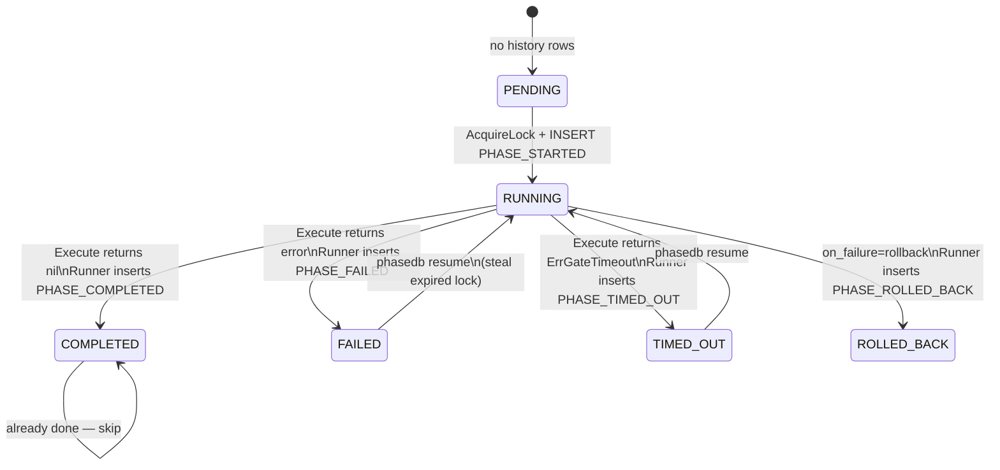
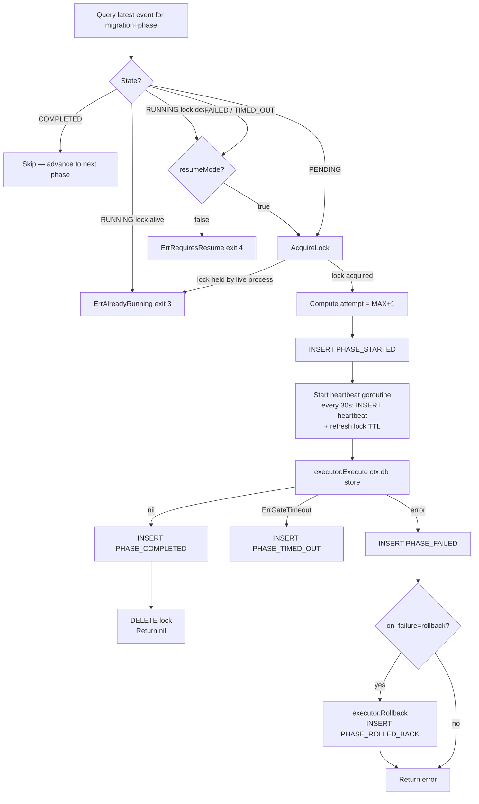
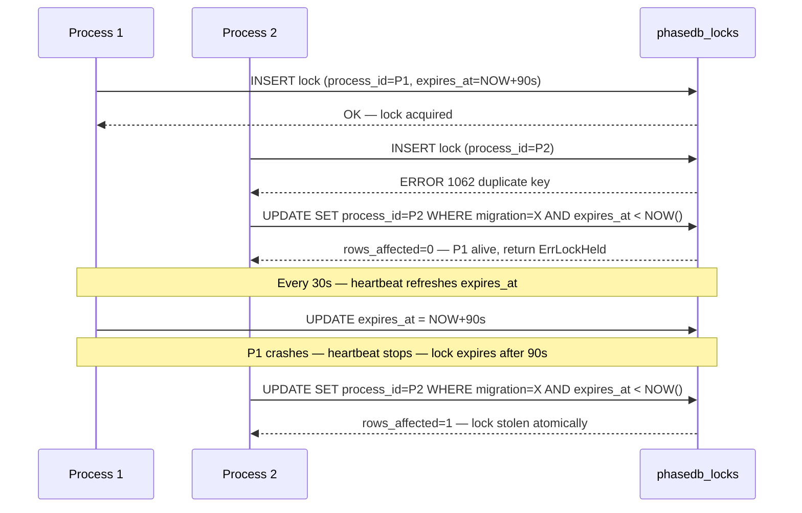
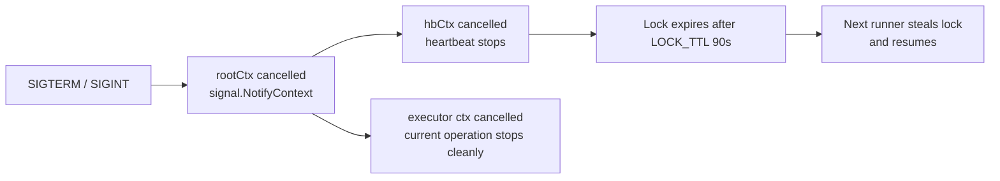

# Runner Internals

## Phase State Machine

Each phase in a migration moves through these states, derived from the most recent row in `phasedb_history`.



## Runner Loop (per phase)



## Distributed Lock

phasedb uses a single row in `phasedb_locks` as a distributed mutex. No Redis, no ZooKeeper — just MySQL.



### Lock Steal SQL

```sql
-- Atomic steal if prior process is dead:
UPDATE phasedb_locks
SET process_id  = ?,
    acquired_at = NOW(3),
    expires_at  = DATE_ADD(NOW(3), INTERVAL 90 SECOND)
WHERE migration_name = ?
  AND expires_at < NOW(3);
-- rows_affected = 1 → steal succeeded — no TOCTOU race
-- rows_affected = 0 → live process holds lock → exit code 3
```

### Timing Constants

| Constant | Value | Role |
|---|---|---|
| `HEARTBEAT_INTERVAL` | 30s | How often heartbeat goroutine fires |
| `LOCK_TTL` | 90s | `expires_at = NOW() + 90s` on acquire/refresh |
| `DEAD_THRESHOLD` | 90s | `heartbeat_at < NOW() - 90s` = process dead |

These three are **coupled**. `LOCK_TTL` must equal `DEAD_THRESHOLD` must be ≥ `3 × HEARTBEAT_INTERVAL`. Changing one without the others breaks liveness detection.

## SIGTERM Handling



The lock is **not** explicitly released on SIGTERM — the process may be mid-DDL. The next `phasedb resume` steals the expired lock after 90s.

## Rollback Scope

`on_failure: rollback` (YAML) or `--on-failure rollback` (CLI) calls `Rollback()` on the **single failing phase only**. It does not cascade to prior already-completed phases.

To roll back multiple phases in reverse order, use:

```bash
phasedb rollback --migration my_migration --to expand
```

This explicitly runs rollback from the current phase down to the target phase.

## Resume vs Run

| | `phasedb run` | `phasedb resume` |
|---|---|---|
| `resumeMode` | `false` | `true` |
| STARTED/FAILED state | returns exit 4 | proceeds to step 6 |
| Lock held by live process | returns exit 3 | returns exit 3 |
| Dead lock | returns exit 4 | steals lock, continues |

Both share the same runner — the only difference is the `resumeMode` boolean.
